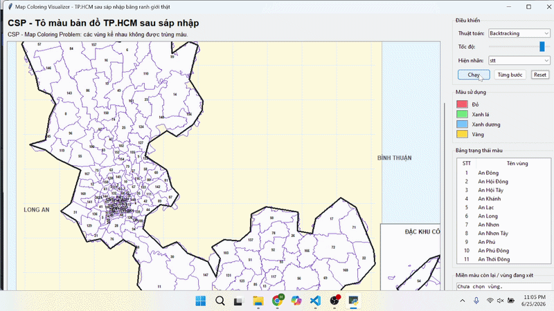
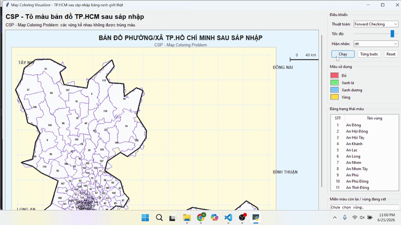
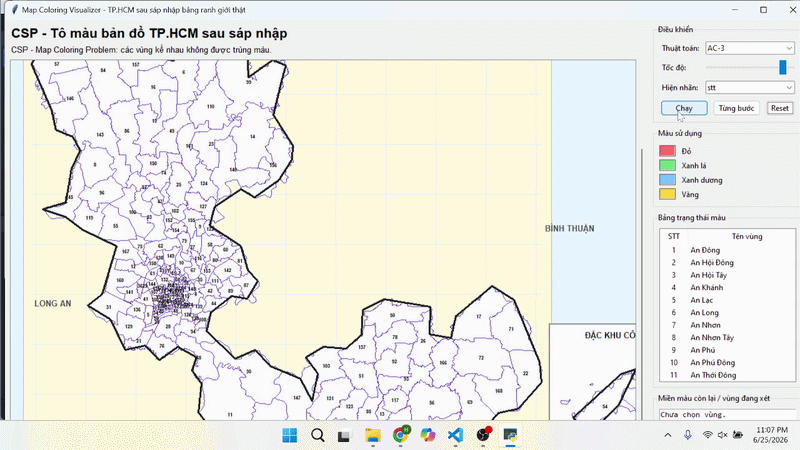
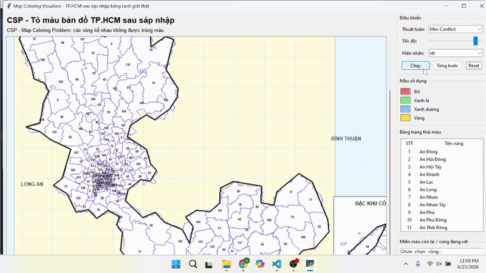

# 🗺️ CSP Map Coloring Visualizer – TP.HCM sau sáp nhập

Ứng dụng trực quan hóa bài toán **Constraint Satisfaction Problem (CSP)** bằng cách tô màu các phường/xã trên bản đồ TP.HCM sau sáp nhập.

Mỗi vùng được xem là một biến CSP. Hai vùng có ranh giới chung phải được tô bằng **hai màu khác nhau**. Chương trình sử dụng bốn màu: **Đỏ, Xanh lá, Xanh dương và Vàng**, đồng thời mô phỏng từng bước các thuật toán giải để người học theo dõi được quá trình chọn vùng, thử màu, loại màu, quay lui và hoàn tất lời giải.

---

## ✨ Chức năng chính

- Đọc **168 vùng** từ dữ liệu `Wards.json` dạng TopoJSON.
- Tự suy ra quan hệ kề nhau: hai vùng dùng chung một arc biên sẽ được xem là kề nhau.
- Hiển thị bản đồ, viền ngoài hành chính và phần **Đặc khu Côn Đảo**.
- Chọn một trong 4 thuật toán:
  - Backtracking
  - Forward Checking
  - AC-3 + Backtracking
  - Min-Conflict
- Chạy tự động hoặc xem **từng bước**.
- Điều chỉnh tốc độ mô phỏng.
- Đổi nhãn bản đồ: không hiện nhãn / số thứ tự / tên vùng.
- Xem bảng trạng thái màu, số vùng kề, miền màu còn lại và log hành động.
- Rê chuột hoặc chọn một vùng trong bảng để xem thông tin vùng đó.

---

## 🧩 Mô hình bài toán CSP

| Thành phần | Ý nghĩa trong project |
|---|---|
| **Biến** | Mỗi phường/xã trên bản đồ |
| **Miền giá trị** | `Đỏ`, `Xanh lá`, `Xanh dương`, `Vàng` |
| **Ràng buộc** | Hai vùng kề nhau không được trùng màu |
| **Lời giải** | Tất cả vùng được tô màu và không có cặp vùng kề nào trùng màu |

Ví dụ: nếu `An Đông` kề `An Khánh`, hai vùng này không thể cùng nhận màu `Đỏ`.

---

## 📁 Cấu trúc project

```text
CSP_Map_Coloring/
│
├── Main.ipynb                # Giao diện Tkinter và điều khiển mô phỏng
├── backtracking.py           # Backtracking
├── forwardchecking.py        # Forward Checking + Backtracking
├── ac3.py                    # AC-3 + Backtracking
├── minconflict.py            # Min-Conflict
│
├── Wards.json                # TopoJSON các phường/xã
├── provNew.geojson           # Viền ngoài TP.HCM sau sáp nhập
│
├── gif/
│   ├── Backtracking.gif
│   ├── Forwardchecking.gif
│   ├── AC3.gif
│   └── MinConflict.gif
│
└── README.md
```

> **Lưu ý:** Tên file Python phải đúng như phần import trong `Main.ipynb`: `backtracking.py`, `forwardchecking.py`, `ac3.py`, `minconflict.py`.

---

## ⚙️ Yêu cầu

- Python 3.10 trở lên.
- Jupyter Notebook hoặc JupyterLab để mở `Main.ipynb`.
- `tkinter` thường đã có sẵn cùng Python trên Windows.

Project chỉ dùng thư viện chuẩn của Python: `json`, `math`, `os`, `tkinter` và `random`; không cần cài thêm thư viện bản đồ bên ngoài.

Nếu máy chưa có Jupyter Notebook:

```bash
pip install notebook
```

Trên một số bản Linux, nếu lỗi thiếu Tkinter, cài gói `python3-tk` của hệ điều hành trước khi chạy.

---

## 🚀 Cách chạy

### 1. Mở Terminal tại thư mục project

```bash
cd duong-dan-den/CSP_Map_Coloring
```

### 2. Khởi động Jupyter

```bash
jupyter notebook Main.ipynb
```

Hoặc:

```bash
jupyter lab Main.ipynb
```

### 3. Chạy chương trình

Trong Jupyter, mở `Main.ipynb` rồi chọn:

```text
Run → Run All Cells
```

Cửa sổ **Map Coloring Visualizer** sẽ xuất hiện.

> Không chạy bằng lệnh `python Main.ipynb`, vì đây là file Jupyter Notebook chứ không phải file `.py`.

---

## 🖥️ Cách sử dụng giao diện

1. Chọn thuật toán ở ô **Thuật toán**.
2. Chỉnh thanh **Tốc độ** nếu muốn mô phỏng nhanh hoặc chậm hơn.
3. Chọn kiểu nhãn tại **Hiện nhãn**:
   - `none`: không hiện nhãn
   - `stt`: hiện số thứ tự vùng
   - `name`: hiện tên vùng
4. Nhấn **Chạy** để thuật toán chạy liên tục.
5. Nhấn **Từng bước** để theo dõi từng trạng thái.
6. Nhấn **Reset** để xóa kết quả hiện tại và chạy lại.
7. Theo dõi:
   - **Bảng trạng thái màu**: màu hiện tại và số vùng kề của mỗi vùng.
   - **Miền màu còn lại / vùng đang xét**: miền giá trị còn có thể dùng.
   - **Bảng hành động thực hiện**: log chọn vùng, thử màu, cắt tỉa, quay lui hoặc hoàn tất.

---

## 🧠 Các thuật toán sử dụng

### 1. Backtracking

Backtracking tô từng vùng theo thứ tự lựa chọn, thử lần lượt các màu. Khi một màu gây trùng với vùng kề đã tô, thuật toán loại màu đó. Nếu một vùng không còn màu hợp lệ, thuật toán quay lui để đổi quyết định trước đó.

Trong project, vùng tiếp theo ưu tiên vùng có nhiều vùng kề đã được tô hoặc có bậc kề lớn hơn. Cách này giúp phát hiện ràng buộc sớm hơn so với chọn vùng tùy ý.

**Ưu điểm**
- Đầy đủ: tìm được lời giải nếu lời giải tồn tại.
- Dễ theo dõi, phù hợp để minh họa cơ chế quay lui CSP.

**Hạn chế**
- Có thể chỉ phát hiện nhánh sai khá muộn.
- Số nhánh cần thử có thể tăng mạnh khi bản đồ lớn hoặc số màu ít.

<p align="center">
  
</p>

---

### 2. Forward Checking

Forward Checking vẫn dùng Backtracking, nhưng sau khi tô một vùng sẽ xóa màu vừa dùng khỏi miền màu của các vùng kề chưa tô. Nếu miền màu của một vùng bị rỗng, nhánh hiện tại bị loại ngay thay vì đợi đến lúc chọn vùng đó.

Project dùng **MRV (Minimum Remaining Values)** để ưu tiên vùng còn ít màu hợp lệ nhất; nếu bằng nhau sẽ ưu tiên vùng có nhiều hàng xóm hơn.

**Ưu điểm**
- Phát hiện bế tắc sớm hơn Backtracking cơ bản.
- Thường giảm số lần quay lui.
- Phù hợp để quan sát rõ việc thu hẹp miền giá trị.

**Hạn chế**
- Chỉ lan truyền trực tiếp đến các vùng kề với vùng vừa tô.
- Vẫn có thể phải quay lui nếu xung đột nằm xa hơn một bước.

<p align="center">
  
</p>

---

### 3. AC-3 + Backtracking

Phiên bản AC-3 của project sử dụng Backtracking để tạo lời giải, sau đó áp dụng **arc consistency** sau mỗi lần gán màu. AC-3 tiếp tục lan truyền việc loại màu qua các quan hệ kề nhau; nếu miền màu của một vùng bị rỗng, nhánh đó bị loại.

Project cũng dùng MRV kết hợp bậc kề để chọn vùng chưa tô.

**Ưu điểm**
- Cắt tỉa mạnh hơn Forward Checking trong nhiều trường hợp.
- Có khả năng phát hiện mâu thuẫn lan truyền qua nhiều vùng.
- Vẫn đầy đủ như Backtracking: nếu có lời giải thì có thể tìm được.

**Hạn chế**
- Mỗi lần gán cần xử lý thêm hàng đợi cung `(Xi, Xj)`, nên chi phí mỗi bước cao hơn.
- Với bài toán ít ràng buộc, phần chi phí lan truyền có thể chưa chắc bù lại số nhánh giảm được.

<p align="center">
  
</p>

---

### 4. Min-Conflict

Min-Conflict là local search. Thuật toán bắt đầu bằng cách tô ngẫu nhiên toàn bộ bản đồ, sau đó liên tục chọn một vùng đang xung đột và đổi sang màu làm số xung đột nhỏ nhất.

Trong project, thuật toán dừng khi không còn xung đột hoặc khi đã chạy tối đa `5000` bước.

**Ưu điểm**
- Thường tìm kết quả nhanh trên CSP lớn.
- Không cần lưu cây tìm kiếm và không phải quay lui theo kiểu Backtracking.
- Phù hợp cho bài toán tô màu có nhiều biến.

**Hạn chế**
- Có tính ngẫu nhiên; số bước và kết quả chạy có thể khác nhau giữa các lần.
- Không bảo đảm tìm được lời giải trong giới hạn 5000 bước.
- Có thể bị kẹt ở trạng thái còn xung đột.

<p align="center">
  
</p>

---

## 📊 So sánh các thuật toán

| Tiêu chí | Backtracking | Forward Checking | AC-3 + Backtracking | Min-Conflict |
|---|---|---|---|---|
| Nhóm phương pháp | Tìm kiếm có quay lui | CSP có suy diễn | CSP có suy diễn mạnh | Local search |
| Bảo đảm tìm lời giải nếu tồn tại | Có | Có | Có | Không bảo đảm trong số bước giới hạn |
| Phát hiện nhánh sai | Muộn | Sớm ở vùng kề trực tiếp | Sớm hơn nhờ lan truyền ràng buộc | Không theo nhánh; sửa xung đột |
| Quay lui | Có thể nhiều | Thường ít hơn Backtracking | Thường ít hơn khi ràng buộc dày | Không dùng quay lui |
| Tính ổn định giữa các lần chạy | Cao | Cao | Cao | Thấp hơn do khởi tạo/chọn ngẫu nhiên |
| Chi phí mỗi bước | Thấp | Trung bình | Cao hơn | Thấp đến trung bình |
| Phù hợp nhất | Minh họa CSP cơ bản | Bài toán vừa, cần trực quan | Cần lời giải chính xác và cắt tỉa tốt | Bài toán lớn, cần nghiệm nhanh |

---

## 🔎 Nhận xét trong cùng nhóm

### Nhóm tìm kiếm chính xác: Backtracking, Forward Checking và AC-3 + Backtracking

- **Backtracking** là nền tảng đơn giản, dễ giải thích nhất, nhưng dễ phải quay lui nhiều vì chưa nhìn trước miền màu của các vùng khác.
- **Forward Checking** là cải tiến trực tiếp, vì sau mỗi lần tô sẽ kiểm tra trước các vùng kề chưa tô. Đây là lựa chọn cân bằng tốt giữa tốc độ xử lý và khả năng trực quan hóa.
- **AC-3 + Backtracking** lan truyền ràng buộc sâu hơn Forward Checking. Khi số vùng kề và ràng buộc nhiều, nó có khả năng loại nhánh sớm hơn. Đổi lại, mỗi lần tô sẽ mất thêm chi phí để duy trì arc consistency.

**Đại diện khuyến nghị của nhóm chính xác:** `AC-3 + Backtracking` khi cần ưu tiên tính đúng đắn và khả năng cắt tỉa. Với mục tiêu trình bày dễ hiểu hoặc mô phỏng mượt, `Forward Checking` thường là lựa chọn cân bằng hơn.

### Nhóm local search: Min-Conflict

- **Min-Conflict** không xây dựng cây tìm kiếm hoàn chỉnh. Nó tô gần như toàn bộ bản đồ ngay từ đầu rồi sửa dần các vùng gây xung đột.
- Thuật toán này phù hợp khi số vùng tăng lớn, nhưng kết quả phụ thuộc vào khởi tạo ngẫu nhiên và giới hạn bước.

**Đại diện của nhóm local search:** `Min-Conflict`.

---

## ⚖️ So sánh các đại diện giữa hai nhóm

| Tiêu chí | AC-3 + Backtracking | Min-Conflict |
|---|---|---|
| Mục tiêu | Tìm lời giải hợp lệ một cách có hệ thống | Giảm dần số xung đột để tìm nghiệm nhanh |
| Bảo đảm | Có, nếu có đủ thời gian/bộ nhớ | Không, vì có thể dừng ở giới hạn bước hoặc kẹt cục bộ |
| Tính lặp lại | Cao với cùng dữ liệu và thứ tự màu | Có thể khác nhau giữa các lần chạy |
| Phù hợp | Báo cáo cần giải thích rõ từng quyết định | Thử nghiệm CSP lớn, cần nghiệm nhanh |
| Nhược điểm chính | Chi phí lan truyền ràng buộc | Không chắc chắn tìm được nghiệm trong một lần chạy |

**Kết luận:**  
- Khi cần một lời giải đáng tin cậy, log rõ ràng và có thể giải thích trong báo cáo, chọn **AC-3 + Backtracking**.  
- Khi mở rộng lên rất nhiều vùng hoặc cần thử tìm nghiệm nhanh, chọn **Min-Conflict**, đồng thời nên chạy nhiều lần hoặc cố định random seed để so sánh công bằng.

> Không nên kết luận thuật toán nào “nhanh nhất” chỉ dựa trên GIF, vì tốc độ thanh mô phỏng Tkinter và số bước hiển thị làm thay đổi thời gian quan sát. Để benchmark công bằng, nên chạy cùng dữ liệu, cùng tập 4 màu, cùng điều kiện ban đầu và đo thời gian xử lý không bao gồm thời gian vẽ giao diện.

---

## 🛠️ Công nghệ sử dụng

- Python    
- Tkinter
- Jupyter Notebook
- JSON / TopoJSON / GeoJSON
- Constraint Satisfaction Problem (CSP)

---

## 👨‍💻 Thành viên

- Trần Hải Đạt
  
## 🚀 Link GITHUB

https://github.com/haidat2207/AI/tree/main/CSP