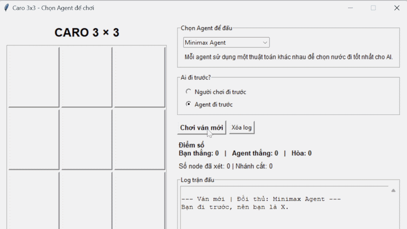
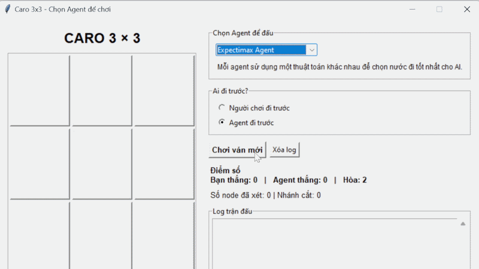

# 🎮 Caro 3×3 – AI Adversarial Search Visualizer

Ứng dụng mô phỏng trò chơi **Caro 3×3 (Tic-Tac-Toe)** giữa người chơi và AI. Người chơi có thể chọn AI Agent, chọn bên đi trước, theo dõi nước đi, kết quả từng ván, số node đã xét và số nhánh bị cắt tỉa.

Project dùng ba thuật toán thuộc nhóm **tìm kiếm đối kháng**:

- Minimax
- Alpha-Beta Pruning
- Expectimax

---

## ✨ Chức năng chính

- Chơi Caro 3×3 trực tiếp bằng giao diện Tkinter.
- Chọn một trong ba AI Agent trước mỗi ván.
- Chọn **người chơi** hoặc **Agent** đi trước; bên đi trước luôn mang ký hiệu **X**.
- Hiển thị điểm thắng của người chơi, Agent và số ván hòa trong phiên chạy.
- Ghi log nước đi, điểm đánh giá, số node đã xét và số nhánh bị cắt.
- Tô màu ba ô tạo thành hàng thắng.
- Có GIF minh họa hoạt động của từng Agent.

---

## 📁 Cấu trúc project

```text
├── __pycache__/                         # Sinh tự động khi chạy Python (có thể bỏ qua)
│
├── gif/
│   ├── AlphaBeta.gif
│   ├── Expectimax.gif
│   └── Minimax.gif
│
├── alphabeta_agent.py                   # AI Alpha-Beta Pruning
├── expectimax_agent.py                  # AI Expectimax
├── minimax_agent.py                     # AI Minimax
├── main.py                              # Giao diện và điều khiển trò chơi
└── README.md
```

---

## 🛠️ Yêu cầu môi trường

- Python 3.x
- Tkinter (thường đã đi kèm khi cài Python trên Windows)

Project không dùng thư viện bên ngoài, nên không cần chạy `pip install`.

Kiểm tra Python:

```bash
python --version
```

Có thể kiểm tra Tkinter bằng lệnh:

```bash
python -m tkinter
```

Nếu một cửa sổ nhỏ hiện ra thì Tkinter đã sẵn sàng.

---

## 🚀 Cách chạy

Mở Terminal/CMD tại thư mục project và chạy:

```bash
python main.py
```

> Lưu ý: Tên file phải đúng là `main.py`, đồng thời ba file `minimax_agent.py`, `alphabeta_agent.py` và `expectimax_agent.py` phải nằm cùng thư mục với nó.

---

## 🕹️ Hướng dẫn sử dụng

1. Chọn Agent ở mục **“Chọn Agent để đấu”**.
2. Chọn **“Người chơi đi trước”** hoặc **“Agent đi trước”**.
3. Nhấn **“Chơi ván mới”**.
4. Khi đến lượt mình, bấm vào một ô trống trên bàn cờ để đánh dấu.
5. Theo dõi phần **Log trận đấu** và chỉ số:
   - **Số node đã xét**: số trạng thái bàn cờ thuật toán đã duyệt.
   - **Nhánh cắt**: số lần Alpha-Beta dừng xét tiếp một nhánh vì nhánh đó không thể cho kết quả tốt hơn.
6. Nhấn **“Xóa log”** khi muốn làm trống lịch sử hiển thị. Điểm số vẫn được giữ trong phiên chạy hiện tại.

---

## 🧠 Mô hình trò chơi và cách chấm điểm

Bàn cờ gồm 9 ô, được biểu diễn bằng danh sách một chiều. AI ưu tiên thứ tự nước đi:

```text
Trung tâm → các góc → các cạnh
```

Mỗi trạng thái kết thúc được chấm như sau:

| Trạng thái | Điểm đánh giá |
|---|---:|
| AI thắng | `10 - depth` |
| Người chơi thắng | `depth - 10` |
| Hòa | `0` |

Nhờ phụ thuộc vào `depth`, AI ưu tiên thắng sớm hơn và trì hoãn thất bại lâu hơn khi không thể tránh thua.

---

## 🤖 Các thuật toán sử dụng

### 1. Minimax

Minimax giả định cả AI và đối thủ đều chơi tối ưu. AI là nút **MAX**, luôn chọn nước đi có điểm cao nhất; người chơi là nút **MIN**, luôn chọn nước làm giảm điểm của AI nhiều nhất. Thuật toán duyệt toàn bộ các khả năng cho đến khi gặp trạng thái thắng, thua hoặc hòa.

**Ưu điểm:** Cho nước đi tối ưu trong trò chơi đối kháng xác định, không có ngẫu nhiên.  
**Hạn chế:** Phải xét nhiều trạng thái, nên khi không gian trò chơi lớn sẽ chậm.

### 2. Alpha-Beta Pruning

Alpha-Beta dùng cùng nguyên lý và cho chất lượng nước đi tương đương Minimax, nhưng thêm hai cận:

- **Alpha:** giá trị tốt nhất MAX đã tìm được.
- **Beta:** giá trị tốt nhất MIN đã tìm được.

Khi `alpha >= beta`, nhánh còn lại không thể ảnh hưởng đến quyết định cuối cùng nên được cắt bỏ.

**Ưu điểm:** Vẫn tối ưu như Minimax nhưng thường xét ít node hơn.  
**Hạn chế:** Hiệu quả cắt tỉa phụ thuộc vào thứ tự sinh nước đi.

### 3. Expectimax

Expectimax vẫn để AI chọn giá trị lớn nhất ở nút MAX, nhưng xem lượt đối thủ là một **nút ngẫu nhiên**. Trong project này, mọi nước đi hợp lệ của đối thủ được giả định có xác suất bằng nhau, nên điểm của nút đối thủ là trung bình điểm các nước đi có thể xảy ra.

**Ưu điểm:** Phù hợp khi đối thủ hoặc môi trường có tính ngẫu nhiên.  
**Hạn chế:** Không giả định đối thủ luôn chọn nước đi gây bất lợi nhất cho AI; vì vậy không phải lựa chọn mặc định tốt nhất khi người chơi cố tình chơi đối kháng tối ưu.

---

## 📊 So sánh các thuật toán trong nhóm tìm kiếm đối kháng

| Tiêu chí | Minimax | Alpha-Beta | Expectimax |
|---|---|---|---|
| Mô hình đối thủ | Chơi tối ưu để chống AI | Chơi tối ưu để chống AI | Chọn nước đi ngẫu nhiên / xác suất đều |
| Chất lượng quyết định với Caro đối kháng | Tối ưu | Tối ưu, tương đương Minimax | Tối ưu theo giá trị kỳ vọng, không phải theo tình huống xấu nhất |
| Có cắt tỉa nhánh | Không | Có | Không trong phiên bản này |
| Số node cần xét | Nhiều | Thường ít hơn Minimax | Nhiều, vì vẫn duyệt các khả năng |
| Tình huống phù hợp | Game đối kháng nhỏ, cần dễ giải thích | Game đối kháng xác định, cần hiệu quả | Đối thủ hành động không chắc chắn hoặc có xác suất |

### Nhận xét từng thuật toán

- **Minimax** là phiên bản nền tảng, dễ hiểu nhất để mô phỏng quan hệ MAX–MIN. Tuy nhiên, nó không bỏ qua bất kỳ nhánh nào.
- **Alpha-Beta** là cải tiến trực tiếp của Minimax. Với cùng bàn cờ, cùng hàm đánh giá và cùng thứ tự nước đi, nó giữ nguyên quyết định của Minimax nhưng có thể loại bỏ các nhánh không cần thiết. Đây là cách so sánh rõ nhất qua chỉ số **“Nhánh cắt”** trong giao diện.
- **Expectimax** thay đổi giả định về đối thủ: thay vì luôn chọn nước bất lợi nhất, đối thủ được xem như hành động ngẫu nhiên. Vì người chơi thật có thể cố ý chặn AI, Expectimax có thể mạo hiểm hơn Minimax hoặc Alpha-Beta.

### Kết luận lựa chọn đại diện

Với **Caro 3×3 giữa hai bên cạnh tranh trực tiếp**, **Alpha-Beta Pruning** là lựa chọn tốt nhất để đại diện nhóm: nó cho quyết định tối ưu như Minimax nhưng tiết kiệm việc duyệt nhánh. 

**Expectimax** không “yếu” hơn trong mọi bài toán; nó phù hợp hơn khi đối thủ không hoàn toàn đối kháng hoặc hành động mang tính ngẫu nhiên. Tuy nhiên, trong Caro người đấu có thể chủ động chọn nước đi tốt nhất để chặn AI, nên giả định của Minimax/Alpha-Beta phù hợp hơn.

> Với bàn cờ Caro 3×3, cả ba thuật toán đều chạy nhanh. Khác biệt về số node và cắt tỉa sẽ rõ rệt hơn khi áp dụng lên trò chơi có không gian trạng thái lớn hơn.

---

## 🎞️ GIF demo

### Minimax Agent

<p align="center">
  
</p>

### Alpha-Beta Agent

<p align="center">
  
</p>

### Expectimax Agent

<p align="center">
  
</p>

---

## 🧰 Công nghệ sử dụng

- Python
- Tkinter
- Tìm kiếm đối kháng: Minimax, Alpha-Beta Pruning, Expectimax

---

## 👨‍💻 Tác giả

- Trần Hải Đạt

---


## 🚀Link GITHUB

https://github.com/haidat2207/AI/tree/main/CaroChest