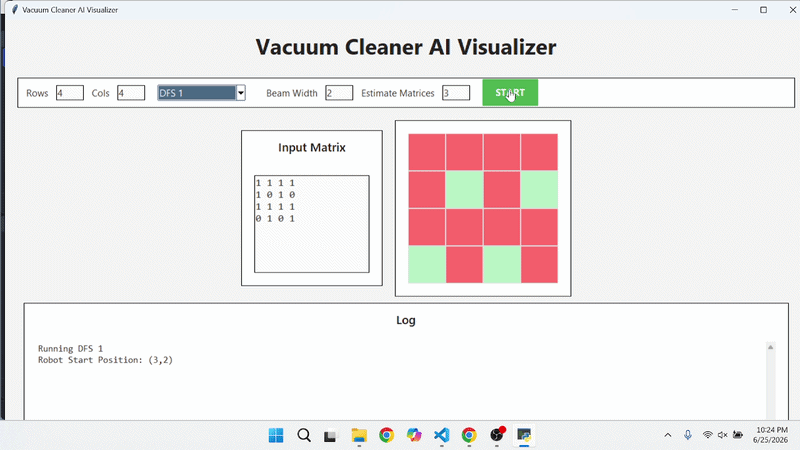
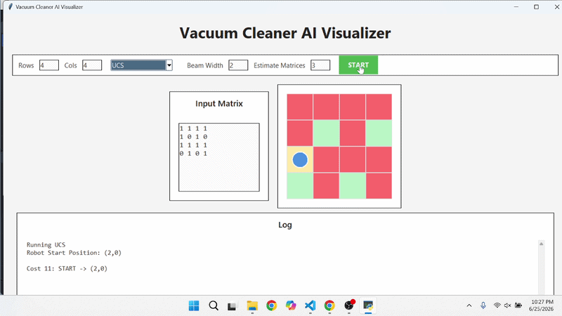
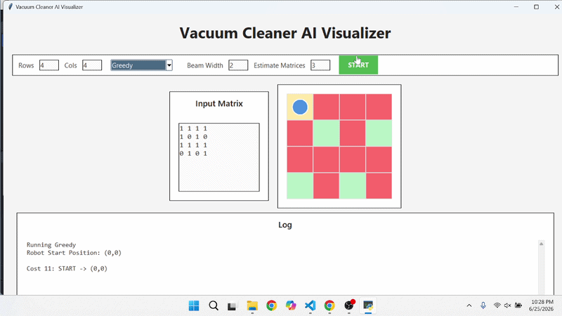
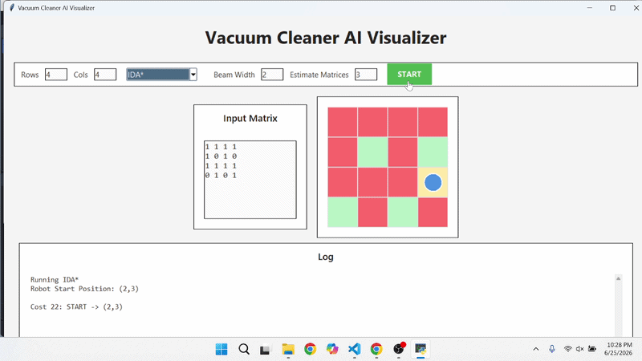
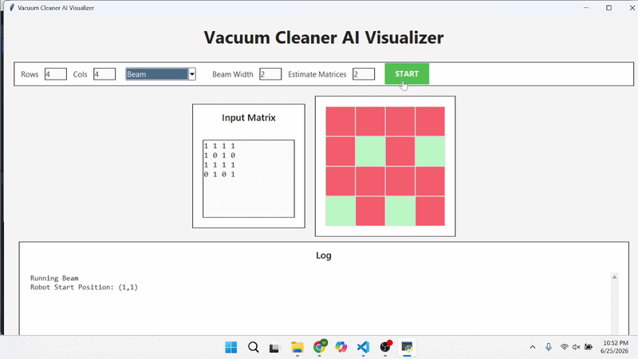
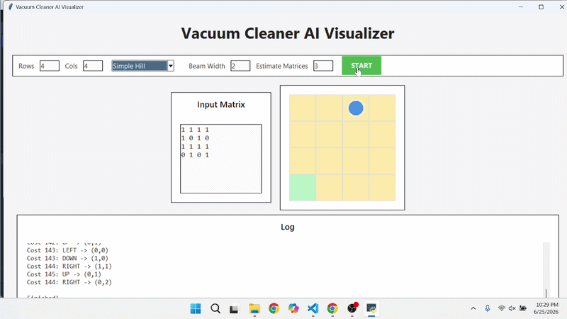
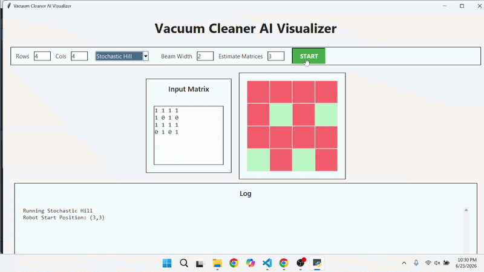
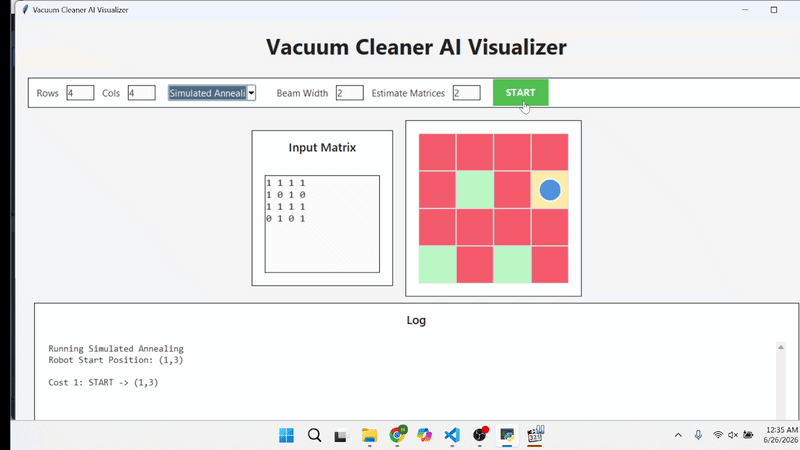
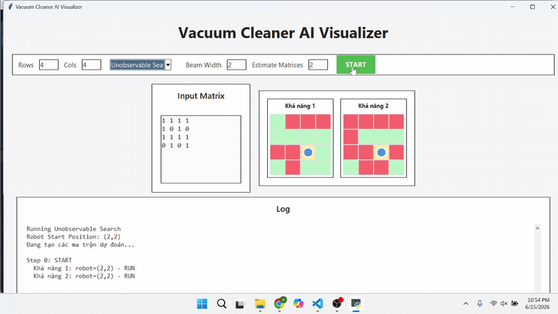
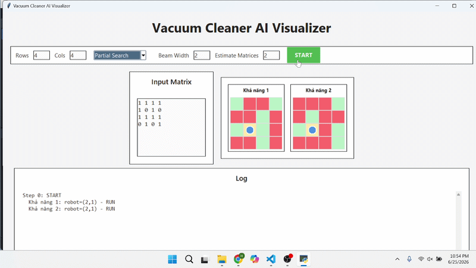

# 🧹 Vacuum Cleaner AI Visualizer

Ứng dụng trực quan hóa bài toán **máy hút bụi thông minh** trên lưới 2D. Chương trình mô phỏng quá trình robot di chuyển, làm sạch các ô bẩn và hiển thị từng bước thực hiện của nhiều nhóm thuật toán tìm kiếm AI.

Mục tiêu của bài toán là đưa toàn bộ bản đồ về trạng thái sạch hoàn toàn.

---

## ✨ Chức năng chính

- Nhập số hàng, số cột và ma trận bản đồ dạng `0` / `1`.
- Chọn một trong **19 thuật toán AI** để mô phỏng.
- Robot xuất phát ngẫu nhiên tại một ô trên bản đồ.
- Hiển thị trực quan các ô bẩn, ô sạch, ô đã đi qua và vị trí robot.
- Chạy hoạt ảnh từng bước và ghi log hành động, tọa độ, chi phí.
- Hỗ trợ các bài toán không quan sát được, quan sát một phần và tìm kiếm AND-OR với nhiều trạng thái giả định.
- Cho phép nhập **Beam Width** khi dùng Beam Search và **Estimate Matrices** khi dùng Unobservable Search hoặc Partial Search.

---

## 🧠 Quy ước bản đồ

| Giá trị | Ý nghĩa | Màu hiển thị |
|---:|---|---|
| `1` | Ô bẩn, robot cần làm sạch | Đỏ |
| `0` | Ô sạch | Xanh lá |
| — | Ô robot đã đi qua | Vàng |
| — | Vị trí hiện tại của robot | Xanh dương |

Ví dụ ma trận 4 × 4:

```text
1 1 1 1
1 0 1 0
1 1 1 1
0 1 0 1
```

> Khi dùng các thuật toán thông thường, hãy nhập đủ số hàng và số cột đã chọn. Với **Unobservable Search** và **Partial Search**, chương trình tự tạo các trạng thái/bản đồ giả định để mô phỏng belief state.

---

## 📚 Các thuật toán được cài đặt

| Nhóm | Thuật toán | Mục đích trong chương trình |
|---|---|---|
| Tìm kiếm không có thông tin | BFS 1, BFS 2 | Duyệt theo chiều rộng; có hai phiên bản cài đặt để so sánh. |
|  | DFS 1, DFS 2 | Duyệt theo chiều sâu; có hai phiên bản cài đặt để so sánh. |
|  | IDS 1, IDS 2 | Tìm kiếm sâu dần. |
|  | UCS | Ưu tiên trạng thái có chi phí đường đi thấp hơn. |
| Tìm kiếm có thông tin | Greedy Best-First Search | Chọn hướng theo heuristic. |
|  | A* | Kết hợp chi phí đã đi và heuristic. |
|  | IDA* | Phiên bản deepening của A*. |
|  | Beam Search | Giữ lại số lượng trạng thái tốt nhất theo Beam Width. |
| Tìm kiếm cục bộ | Simple Hill Climbing | Di chuyển theo lựa chọn cải thiện đơn giản. |
|  | Steepest Hill Climbing | Chọn láng giềng cải thiện tốt nhất. |
|  | Stochastic Hill Climbing | Chọn ngẫu nhiên trong các lựa chọn cải thiện. |
|  | Random Restart Hill Climbing | Khởi động lại để giảm nguy cơ kẹt cực trị cục bộ. |
|  | Simulated Annealing | Có thể chấp nhận một số bước kém hơn để thoát cực trị cục bộ. |
| Môi trường không chắc chắn | Unobservable Search | Lập kế hoạch khi robot không biết chính xác trạng thái môi trường. |
|  | Partial Search | Lập kế hoạch từ các trạng thái quan sát một phần. |
|  | AND-OR Search | Mô phỏng lựa chọn hành động và các tình huống có thể xảy ra. |

> Trên giao diện, thuật toán **Steepest Hill** hiện được đặt tên là `Steppest Hill` để khớp với mã nguồn hiện có.

---

## 📁 Cấu trúc thư mục

```text
Vacuum-Cleaner-AI-Visualizer/
│
├── Algorithm/                  # Các file cài đặt thuật toán
│   ├── HutBui_BFS_1.py
│   ├── HutBui_BFS_2.py
│   ├── HutBui_DFS_1.py
│   ├── HutBui_DFS_2.py
│   ├── HutBui_IDS_1.py
│   ├── HutBui_IDS_2.py
│   ├── HutBui_UCS.py
│   ├── HutBui_Greedy.py
│   ├── HutBui_AStar.py
│   ├── HutBui_IDAStar.py
│   ├── HutBui_SimpleHill.py
│   ├── HutBui_SteppestHill.py
│   ├── HutBui_StochasticHill.py
│   ├── HutBui_RandomRestartHill.py
│   ├── HutBui_Beam.py
│   ├── HutBui_SimulatedAnnealing.py
│   ├── HutBui_UnobservableSearch.py
│   ├── HutBui_PartialSearch.py
│   └── HutBui_AndOrSearch.py
│
├── gif/                        # GIF demo của từng thuật toán
├── Main.ipynb                  # Giao diện Tkinter và chương trình chính
└── README.md
```

> Không cần đưa thư mục `__pycache__/` lên GitHub. Có thể thêm `__pycache__/` vào file `.gitignore`.

---

## 🚀 Cách chạy chương trình

### 1. Chuẩn bị môi trường

Cài Python 3 và Jupyter Notebook. Nếu chưa có Jupyter, mở Terminal/PowerShell tại thư mục project rồi chạy:

```bash
python -m pip install notebook
```

### 2. Mở file chính

```bash
jupyter notebook Main.ipynb
```

Sau đó, trong Jupyter Notebook chọn **Run All** để chạy giao diện.

Bạn cũng có thể mở `Main.ipynb` bằng VS Code, chọn Python Kernel rồi bấm **Run All**.

> `tkinter` thường đã đi kèm khi cài Python bản chính thức trên Windows. Không chạy bằng lệnh `python Main.ipynb` vì đây là file Jupyter Notebook.

---

## 🎮 Cách sử dụng giao diện

1. Nhập **Rows** và **Cols** để tạo kích thước lưới.
2. Chọn thuật toán trong danh sách.
3. Với các thuật toán thông thường, nhập ma trận gồm `0` và `1` tại **Input Matrix**.
4. Nếu chọn **Beam**, nhập số trạng thái muốn giữ tại **Beam Width**.
5. Nếu chọn **Unobservable Search** hoặc **Partial Search**, nhập số trạng thái giả định tại **Estimate Matrices**.
6. Nhấn **START** để bắt đầu mô phỏng.
7. Theo dõi bản đồ và phần **Log** để xem hành động, vị trí robot và chi phí trong quá trình chạy.

---

## 🔎 Nhận xét và so sánh các thuật toán

### Lưu ý khi đánh giá kết quả

Trong giao diện, vị trí khởi đầu của robot được sinh ngẫu nhiên. Vì vậy, không nên lấy trực tiếp số bước hiển thị trong các GIF khác nhau để kết luận thuật toán nào nhanh hơn. Để so sánh công bằng, cần chạy các thuật toán trên **cùng ma trận**, **cùng vị trí xuất phát**, **cùng quy tắc chi phí** và cùng điều kiện dừng. Với các thuật toán có yếu tố ngẫu nhiên như Stochastic Hill Climbing, Random Restart Hill Climbing và Simulated Annealing, nên chạy lặp lại nhiều lần rồi so sánh giá trị trung bình.

Các tiêu chí nên dùng gồm: số bước/chi phí của lời giải, số trạng thái đã mở rộng, thời gian chạy, bộ nhớ sử dụng, khả năng tìm được lời giải và mức độ ổn định giữa các lần chạy.

### 1. Nhóm tìm kiếm không có thông tin

| Thuật toán | Nhận xét | Ưu điểm | Hạn chế |
|---|---|---|---|
| BFS | Duyệt theo từng mức độ sâu. | Đầy đủ; tìm lời giải ít bước nhất khi mọi hành động có chi phí bằng nhau. | Tốn bộ nhớ vì phải giữ nhiều trạng thái ở biên tìm kiếm. |
| DFS | Đi sâu theo một nhánh trước khi quay lui. | Dùng ít bộ nhớ; có thể nhanh nếu sớm đi đúng nhánh. | Không đảm bảo đường đi ngắn nhất; dễ đi sâu vào nhánh không hiệu quả. |
| IDS | Lặp lại DFS với giới hạn độ sâu tăng dần. | Đầy đủ như BFS nhưng dùng bộ nhớ thấp gần DFS. | Lặp lại các trạng thái ở những độ sâu trước nên tốn thời gian hơn BFS. |
| UCS | Luôn mở rộng trạng thái có tổng chi phí nhỏ nhất. | Tìm lời giải chi phí thấp nhất khi mọi chi phí không âm. | Dùng hàng đợi ưu tiên và có thể mở rộng nhiều trạng thái, đặc biệt khi không có heuristic. |

**So sánh BFS – DFS – IDS – UCS:** BFS phù hợp khi cần đường đi ngắn nhất với chi phí mỗi bước bằng nhau. DFS phù hợp để minh họa cách tìm kiếm sâu hoặc khi bộ nhớ bị hạn chế, nhưng không phù hợp khi yêu cầu tối ưu. IDS là lựa chọn dung hòa giữa BFS và DFS: giữ được tính đầy đủ nhưng đánh đổi bằng việc duyệt lặp. UCS tổng quát hơn BFS vì xử lý được chi phí hành động khác nhau; tuy nhiên trong bài toán hiện tại, nếu chi phí mỗi lần di chuyển/làm sạch đều bằng nhau thì BFS và UCS có chất lượng lời giải tương đương, còn BFS đơn giản hơn.

**BFS 1 và BFS 2; DFS 1 và DFS 2; IDS 1 và IDS 2** là các phiên bản cài đặt khác nhau, không phải các thuật toán lý thuyết khác nhau. Sự chênh lệch thực tế giữa hai phiên bản thường đến từ thứ tự sinh hành động, cách kiểm tra trạng thái đã thăm và cách lưu đường đi. Vì vậy, chỉ nên kết luận phiên bản nào tốt hơn sau khi chạy cùng một bộ dữ liệu và đo số trạng thái mở rộng/thời gian chạy.

**Đại diện tốt nhất của nhóm:** với mô hình có chi phí mỗi hành động bằng nhau, **BFS** là đại diện phù hợp nhất vì đầy đủ và cho lời giải ít bước nhất. Nếu sau này gán chi phí khác nhau cho việc đi qua ô hoặc làm sạch ô, **UCS** sẽ là đại diện tốt hơn.

### 2. Nhóm tìm kiếm có thông tin

| Thuật toán | Nhận xét | Ưu điểm | Hạn chế |
|---|---|---|---|
| Greedy Best-First Search | Chỉ ưu tiên heuristic `h(n)`. | Thường đi nhanh về phía trạng thái có vẻ tốt. | Có thể bị heuristic đánh lừa; không đảm bảo lời giải tối ưu. |
| A* | Dùng `f(n) = g(n) + h(n)`. | Cân bằng chi phí đã đi và ước lượng còn lại; tối ưu nếu heuristic chấp nhận được. | Tốn bộ nhớ vì cần lưu nhiều trạng thái trong hàng đợi ưu tiên. |
| IDA* | Lặp sâu dần theo ngưỡng `f`. | Cần ít bộ nhớ hơn A*; vẫn có thể tối ưu khi heuristic phù hợp. | Phải mở rộng lại nhiều trạng thái nên thường chậm hơn A*. |
| Beam Search | Chỉ giữ lại một số trạng thái tốt nhất theo Beam Width. | Giới hạn bộ nhớ và có thể chạy nhanh. | Loại bỏ nhiều nhánh; không đảm bảo đầy đủ hay tối ưu. |

**So sánh trong nhóm:** Greedy thường nhanh hơn nhưng chỉ nhìn “gần đích”, nên có thể chọn hướng trước mắt tốt nhưng tổng đường đi kém. A* khắc phục điều này nhờ kết hợp `g(n)` và `h(n)`, do đó phù hợp nhất khi cần lời giải chất lượng. IDA* giữ logic đánh giá của A* nhưng đổi thời gian lấy bộ nhớ, phù hợp khi lưới lớn hoặc máy có ít RAM. Beam Search cho phép điều chỉnh đánh đổi bằng `Beam Width`: Beam Width càng lớn thì giữ được nhiều lựa chọn hơn nhưng tốn bộ nhớ và thời gian hơn; Beam Width nhỏ chạy gọn hơn nhưng dễ bỏ mất lời giải tốt.

**Đại diện tốt nhất của nhóm:** **A*** là lựa chọn cân bằng nhất cho bản đồ xác định và quan sát đầy đủ. Khi bộ nhớ là ràng buộc chính, **IDA*** là phương án thay thế phù hợp hơn.

### 3. Nhóm tìm kiếm cục bộ

| Thuật toán | Nhận xét | Ưu điểm | Hạn chế |
|---|---|---|---|
| Simple Hill Climbing | Chọn ngay láng giềng đầu tiên tốt hơn trạng thái hiện tại. | Rất đơn giản, ít tốn bộ nhớ. | Dễ kẹt ở cực trị cục bộ, plateau hoặc ridge. |
| Steepest Hill Climbing | Xét các láng giềng rồi chọn láng giềng tốt nhất. | Ổn định hơn Simple Hill trong từng bước. | Tốn công đánh giá toàn bộ láng giềng và vẫn có thể kẹt cực trị cục bộ. |
| Stochastic Hill Climbing | Chọn ngẫu nhiên trong các láng giềng cải thiện. | Giảm tính cố định của đường đi, có thể tránh một số nhánh xấu. | Kết quả không ổn định giữa các lần chạy. |
| Random Restart Hill Climbing | Chạy Hill Climbing nhiều lần từ các điểm khởi tạo khác nhau. | Tăng xác suất thoát cực trị cục bộ. | Tốn thời gian do phải khởi động lại nhiều lần. |
| Simulated Annealing | Có thể chấp nhận bước đi xấu ở giai đoạn đầu theo nhiệt độ. | Khả năng thoát cực trị cục bộ tốt; chỉ cần ít bộ nhớ. | Không đảm bảo tối ưu; chất lượng phụ thuộc lịch giảm nhiệt và yếu tố ngẫu nhiên. |

**So sánh trong nhóm:** Simple Hill Climbing nhanh và dễ hiểu nhất nhưng yếu nhất trước cực trị cục bộ. Steepest Hill Climbing chọn bước cải thiện tốt nhất nên hợp lý hơn trong từng lần di chuyển, nhưng vẫn chỉ là tối ưu cục bộ. Stochastic Hill Climbing thay đổi lựa chọn bằng ngẫu nhiên để tăng đa dạng. Random Restart Hill Climbing khắc phục điểm yếu này bằng nhiều lần thử độc lập. Simulated Annealing linh hoạt hơn vì có thể chấp nhận tạm thời một bước kém hơn để tìm đường thoát khỏi vùng kẹt.

**Đại diện tốt nhất của nhóm:** **Simulated Annealing** thường là lựa chọn cân bằng nhất giữa bộ nhớ thấp và khả năng tránh cực trị cục bộ. Khi cần kết quả ổn định hơn, có thể dùng **Random Restart Hill Climbing** và lấy lời giải tốt nhất sau nhiều lần chạy.

### 4. Nhóm môi trường không chắc chắn

| Thuật toán | Nhận xét | Ưu điểm | Hạn chế |
|---|---|---|---|
| Unobservable Search | Robot không biết chính xác trạng thái thật, phải lập kế hoạch trên belief state. | Phù hợp khi không có cảm biến/quan sát. | Không gian belief state tăng rất nhanh; kế hoạch thường bảo thủ hơn. |
| Partial Search | Robot biết một phần thông tin nên belief state được thu hẹp. | Thực tế hơn Unobservable Search; thường cần xét ít khả năng hơn. | Phụ thuộc chất lượng thông tin quan sát và các trạng thái giả định. |
| AND-OR Search | Tạo kế hoạch có điều kiện: nút OR là hành động chọn, nút AND là các kết quả có thể xảy ra. | Phù hợp với hành động có nhiều kết quả; tạo được chính sách ứng phó thay vì một đường đi cố định. | Cây tìm kiếm phân nhánh mạnh; dễ tốn thời gian và bộ nhớ. |

**So sánh trong nhóm:** Unobservable Search khó nhất vì robot phải hành động đúng cho nhiều trạng thái có thể xảy ra mà không nhận phản hồi quan sát. Partial Search thuận lợi hơn do có thêm thông tin, vì vậy belief state nhỏ hơn và việc lập kế hoạch thực tế hơn. AND-OR Search không chỉ lưu các trạng thái chưa biết mà còn xét các kết quả không chắc chắn của hành động; do đó phù hợp khi robot cần có phương án dự phòng cho từng tình huống. Trong chương trình, AND-OR Search còn hiển thị hành động dự đoán và hành động thực hiện để minh họa sự khác nhau giữa kế hoạch và kết quả xảy ra.

**Đại diện của nhóm:** trong bài toán có cảm biến nhưng thông tin chưa đầy đủ, **Partial Search** là đại diện thực tế nhất. Nếu mục tiêu là mô tả môi trường có kết quả hành động không xác định và cần chính sách có điều kiện, **AND-OR Search** là đại diện phù hợp hơn.

### 5. So sánh các thuật toán đại diện giữa các nhóm

Để so sánh ở mức tổng quát, có thể chọn **BFS** (nhóm không có thông tin, giả sử chi phí bằng nhau), **A*** (nhóm có thông tin), **Simulated Annealing** (nhóm cục bộ) và **Partial Search/AND-OR Search** (nhóm không chắc chắn). Các thuật toán này không giải cùng một giả định bài toán, vì vậy không nên chỉ so sánh bằng một con số chi phí; cần đặt chúng trong đúng điều kiện sử dụng.

| Tiêu chí | BFS | A* | Simulated Annealing | Partial Search / AND-OR Search |
|---|---|---|---|---|
| Thông tin đầu vào | Bản đồ xác định, không dùng heuristic | Bản đồ xác định và heuristic | Hàm đánh giá cục bộ, có yếu tố ngẫu nhiên | Belief state hoặc các kết quả không chắc chắn |
| Tính đầy đủ | Có | Có, với điều kiện phù hợp | Không đảm bảo | Phụ thuộc mô hình trạng thái, giới hạn belief/depth và kế hoạch có điều kiện |
| Tính tối ưu | Có khi chi phí đều | Có khi heuristic chấp nhận được | Không đảm bảo | Ưu tiên tính đúng trong nhiều khả năng hơn là tối ưu một đường đi cố định |
| Bộ nhớ | Cao | Cao | Thấp | Cao, có thể tăng rất nhanh theo số khả năng |
| Điểm mạnh chính | Chuẩn so sánh, đơn giản, ít bước | Chất lượng lời giải tốt và hiệu quả hơn khi heuristic tốt | Mở rộng tốt trên không gian lớn, tránh kẹt cục bộ tốt hơn Hill Climbing | Xử lý được thiếu quan sát hoặc kết quả hành động không xác định |
| Trường hợp nên dùng | Lưới nhỏ/trung bình, chi phí đều | Bản đồ xác định, cần đường đi tốt | Cần nhanh một lời giải chấp nhận được, không cần tối ưu tuyệt đối | Môi trường có cảm biến không đầy đủ hoặc có bất định |

### Kết luận chung

Không có một thuật toán tốt nhất cho mọi tình huống. Với bản đồ **xác định, quan sát đầy đủ** và cần lời giải chất lượng, **A*** là lựa chọn tốt nhất của toàn bộ chương trình vì cân bằng giữa chi phí thực tế và heuristic. Nếu mọi bước có chi phí bằng nhau và cần một thuật toán chuẩn để đối chiếu, **BFS** là lựa chọn rõ ràng. Khi không gian trạng thái lớn, bộ nhớ hạn chế và chỉ cần lời giải tốt thay vì tối ưu tuyệt đối, **Simulated Annealing** phù hợp hơn. Với môi trường có bất định, cần chuyển từ việc tìm một đường đi sang lập kế hoạch theo belief state hoặc chính sách có điều kiện; khi đó **Partial Search** hoặc **AND-OR Search** phù hợp hơn A* và BFS.

> Do đó, có thể kết luận: **A*** tốt nhất cho bài toán xác định; **Simulated Annealing** nổi bật trong tìm kiếm cục bộ; **Partial Search/AND-OR Search** cần thiết khi thông tin hoặc kết quả hành động không chắc chắn. Không nên khẳng định A* “tốt nhất tuyệt đối” khi bài toán đã chuyển sang môi trường không quan sát được hoặc không xác định.

---

## 🎞️ Demo các thuật toán

Các GIF dưới đây được đặt trong thư mục [`gif/`](./gif/). Bạn có thể thu gọn/mở rộng từng nhóm để xem demo.

<details>
<summary><b>1. Tìm kiếm không có thông tin</b></summary>

<p align="center"><b>BFS 1</b><br></p>
<p align="center"><b>BFS 2</b><br></p>
<p align="center"><b>DFS 1</b><br></p>
<p align="center"><b>DFS 2</b><br></p>
<p align="center"><b>IDS 1</b><br></p>
<p align="center"><b>IDS 2</b><br></p>
<p align="center"><b>UCS</b><br></p>

</details>

<details>
<summary><b>2. Tìm kiếm có thông tin</b></summary>

<p align="center"><b>Greedy Best-First Search</b><br></p>
<p align="center"><b>A*</b><br></p>
<p align="center"><b>IDA*</b><br></p>
<p align="center"><b>Beam Search</b><br></p>

</details>

<details>
<summary><b>3. Tìm kiếm cục bộ</b></summary>

<p align="center"><b>Simple Hill Climbing</b><br></p>
<p align="center"><b>Steepest Hill Climbing</b><br></p>
<p align="center"><b>Stochastic Hill Climbing</b><br></p>
<p align="center"><b>Random Restart Hill Climbing</b><br></p>
<p align="center"><b>Simulated Annealing</b><br></p>

</details>

<details>
<summary><b>4. Môi trường không chắc chắn và AND-OR Search</b></summary>

<p align="center"><b>Unobservable Search</b><br></p>
<p align="center"><b>Partial Search</b><br></p>
<p align="center"><b>AND-OR Search</b><br></p>

</details>

---

## 🛠️ Công nghệ sử dụng

- Python
- Jupyter Notebook
- Tkinter
- Các thuật toán tìm kiếm AI

---

## 👨‍💻 Thành viên

- Trần Hải Đạt

## 🚀 Link GITHUB

https://github.com/haidat2207/AI/tree/main/MayHutBui