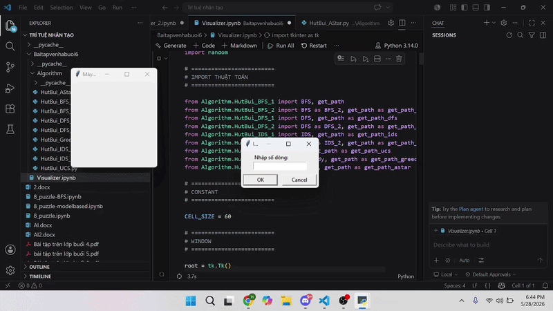

# 🤖 Máy hút bụi AI Visualizer

Project mô phỏng máy hút bụi sử dụng các thuật toán tìm kiếm AI như:

* BFS
* DFS
* UCS
* IDS
* Greedy
* A*

---

## 📁 Cấu trúc project

```bash
├── __pycache__/
│
├── Algorithm/
│   │
│   ├── HutBui_BFS_1.py
│   ├── HutBui_BFS_2.py
│   ├── HutBui_DFS_1.py
│   ├── HutBui_DFS_2.py
│   ├── HutBui_IDS_1.py
│   ├── HutBui_IDS_2.py
│   ├── HutBui_UCS.py
│   ├── HutBui_Greedy.py
│   └── HutBui_AStar.py
│
├── MayHutBuiDemo.gif
├── README.md
└── Visualizer.ipynb
```

---

## 🚀 Cách chạy

### 1. Cài Python

Tải Python:

https://www.python.org/downloads/

### 2. Cài thư viện

```bash
pip install tkinter
```

### 3. Chạy chương trình

```bash
python Main.ipynb
```

---

## 🧠 Các thuật toán sử dụng

| Thuật toán | Mô tả                      |
| ---------- | -------------------------- |
| BFS        | Tìm kiếm theo chiều rộng   |
| DFS        | Tìm kiếm theo chiều sâu    |
| UCS        | Tìm kiếm chi phí thấp nhất |
| IDS        | DFS có giới hạn độ sâu     |
| Greedy     | Chọn heuristic tốt nhất    |
| A*         | Kết hợp cost + heuristic   |

---

## 🎮 Chức năng

* Mô phỏng bản đồ dạng lưới
* Visualize đường đi
* So sánh thuật toán
* Giao diện trực quan bằng Tkinter

---

## ⚡ Mô phỏng

<p align="center">
  
</p>

---

## 👨‍💻 Thành viên

* Trần Hải Đạt

---

## 📌 Công nghệ sử dụng

* Python
* Tkinter
* AI Search Algorithms